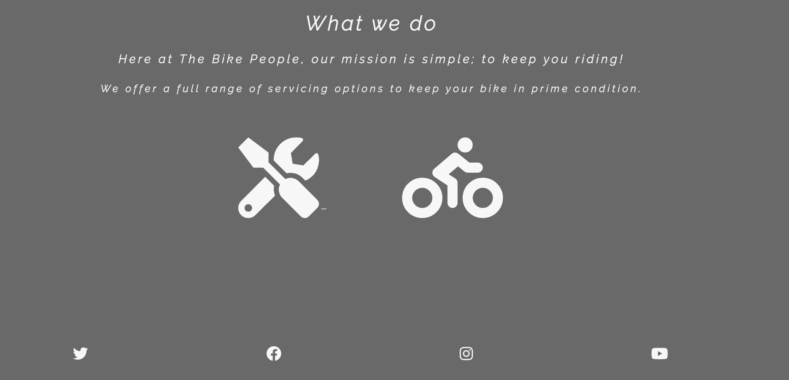
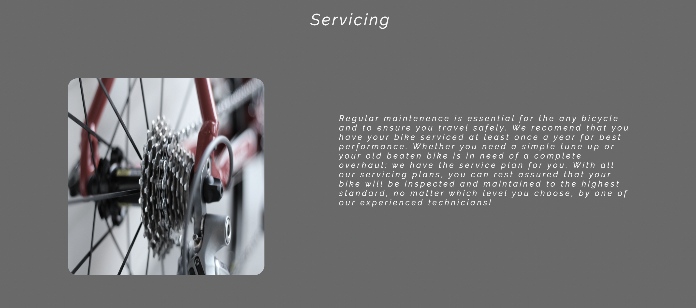
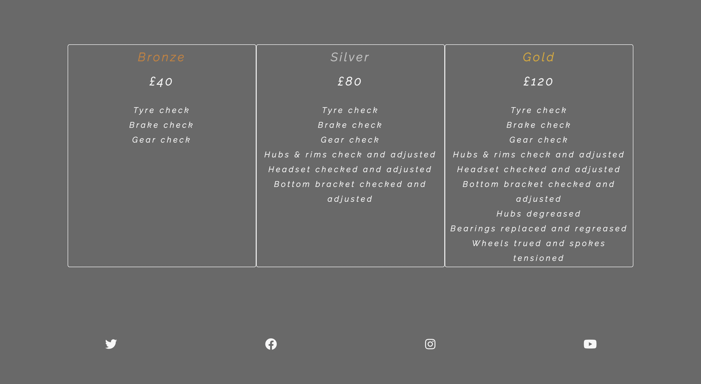
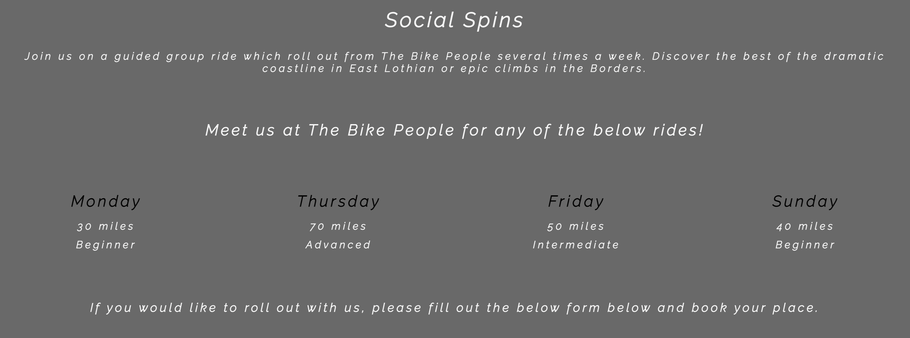
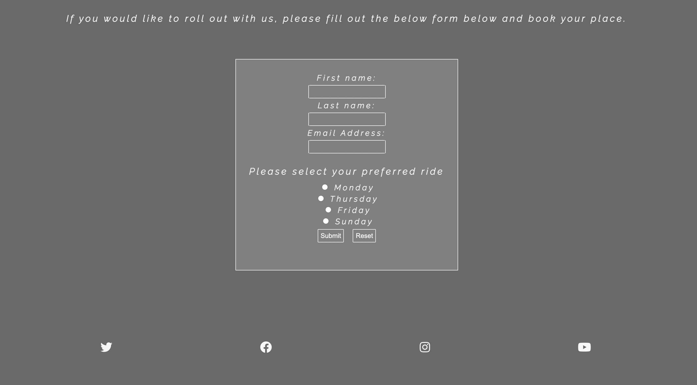

# The Bike People

## Welcome - [Preview The Bike People](https://jamitag.github.io/The-Bike-People/)

This is a website intended for bike users and enthusiasts alike. For anyone wishing to service or maintain 
their bicycle, The Bike People offer service and maintenence plans to meet various requirements and budgets. 
The website will also provide an opportunity for cyclist to come together and socialise by providing access 
to a community of like minded cycling enthusiasts who arrange regular rides around the Edinburgh and Lothian 
region several times a week. Our passionate cycling professionals are knowledgable and skilled, ensuring 
everyone has a cycling experience to remember. Visitors to the website will be able to view detailed 
maintenence requirements as well as book onto any of our group rides which roll out each morning, catering to 
a range of cycling abilities.

 

## Features

### Existing Features

- __Navigation Bar__

The Navigation bar appears at the top of all three pages, maintaining a consistant look across the website. 
Within, users will find links to a relavant area of interest i.e Services or Social Spins. The company name 
appears in the left of the Navigation bar which will direct the user back to the homepage if clicked. Each 
item in the Navigation bar will appear highlighted when on that particular page, to aid navigation.

- __Motivational Image__

The first feature that will be apparant to users is the hero image displayed on the homepage coupled with a 
motivational quote from the legendary, Eddy Merckx. This will leave no doubt in the users mind that this is 
a website designed for cyclists.

- __What we do section__

This section displays the services available to our customers. Two simple options are clearly represented 
leaving the user wihtout any doubt as to their purpose. The user will click on they relevant option and will 
be directed to the page they have selected.

- __Footer__

The footer is made up of links to several social media sites which will open in a new tab when selected.  
The Bike People's social media presence provides us an additional avenue to provide information to our 
customers and where they can engage with ourselves as well as fellow cyclists.

- __Services page__

This page will display all information relating to services available. It will detail each level of service 
and the price so the user can decide which service best fits their needs.

- __Social Spins page__

This page provides information to the user about regular Social Spins which take place 4 times a week. 
Here, the user will discover the when and where as well as suitability of the ride to ensure each participant 
has an enjoyable ride. There is a form on this page for users to book their place on a ride.

### Features for the future

- A chat feature whereby customers can be directed to a chat function with one of our technicians to 
discuss any maintenance / servicing queries.
- A gallery, illustrating the various scenic rides we offer.
- Some animation features across the whole site once developers skill improves.

## Deployment
This site was deployed with GitHub using the below steps:

- Within the relavant repository, select 'Settings'.
- Navigate to the 'Pages' section displayed on the left menu.
- Select the main branch from the drop-down menu and save to display the link to your website.

The Bike People can be viewed [here](https://jamitag.github.io/The-Bike-People/)

## User Experience (UX)

### User Stories

#### As a user

- I want to navigate through the site as smooth as possible.
- Few button clicks as possible to get to my destination.
- Always be aware of my location within the site and have an easy option to return to homepage.
- Detailed description of services on offer.
- Easily identifiable information on rides available.
- Clear method of booking onto rides.
- A way of interacting with The Bike People via social media.

#### As a site owner

- I want to display all the products and services clearly to customers and potential customers.
- I want users to have a smooth and intuitive experience on across the website.
- I want users to use the form for booking onto rides instead of contacting us via email/telephone.
- I want our users to stay in touch through our social media presence.

## Technologies

### Editor
- GitPod

### Languages
- HTML5
- CSS3

### Version control
- GitHub

### Libraries
- Font Awesome
- Google Fonts
- Stock Images

## Testing

Please find all testing information [here](https://jamitag.github.io/The-Bike-People/testing.md)

## Credits

### Content

- I gained inspiration for my Navbar from this [tutorial](https://www.youtube.com/watch?v=PwWHL3RyQgk).
- I opted for a footer, similar in styling to the Love Running example.
- I also used a Hero image on each of my pages with parallels to Love Running.
- I got influence for my servicing details from both of these businesses 
[Harts](https://harts-cyclery.co.uk/servicing) & [Evans](https://www.evanscycles.com/book-a-service).

### Media

I obtained my images from the following stock websites;
- pexels.com
- unsplash.com
- pikwizard.com

A special thank you must also go to my mentor, Sandeep, who is always a great help and put in the extra 
time to assist in developing my project.