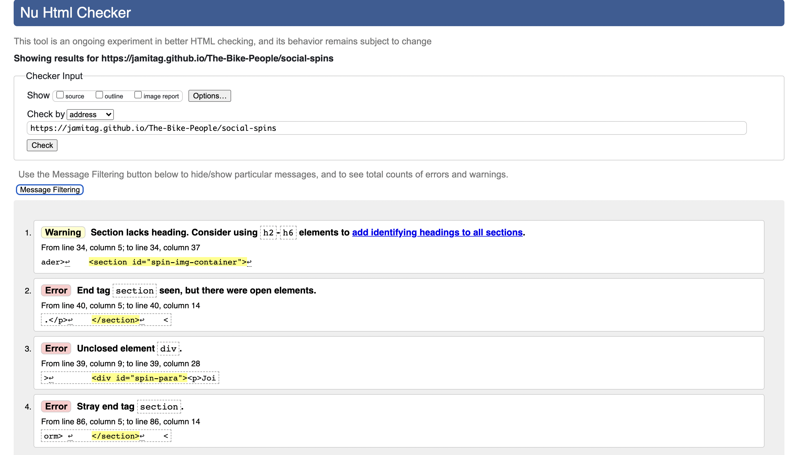
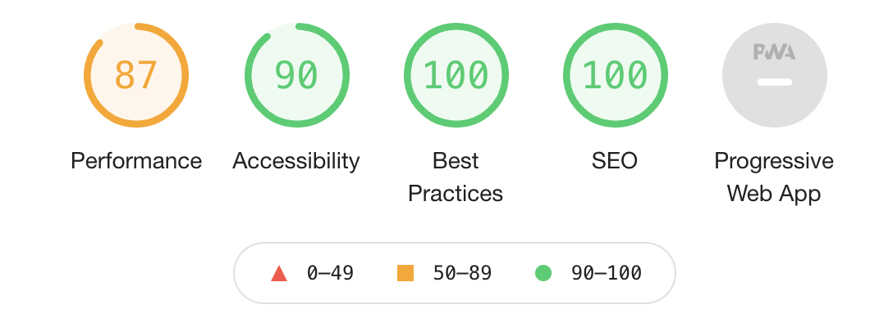
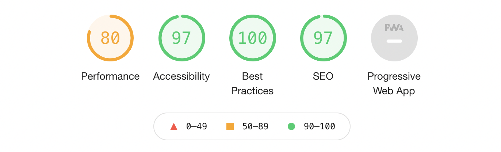
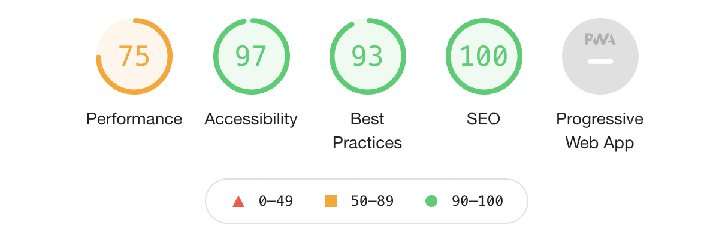
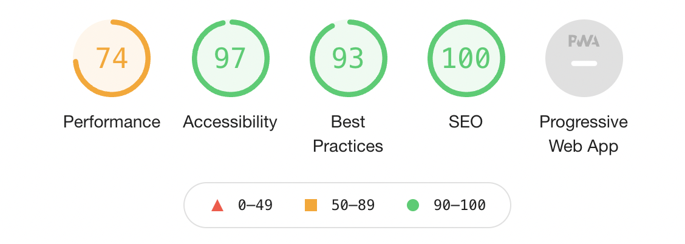
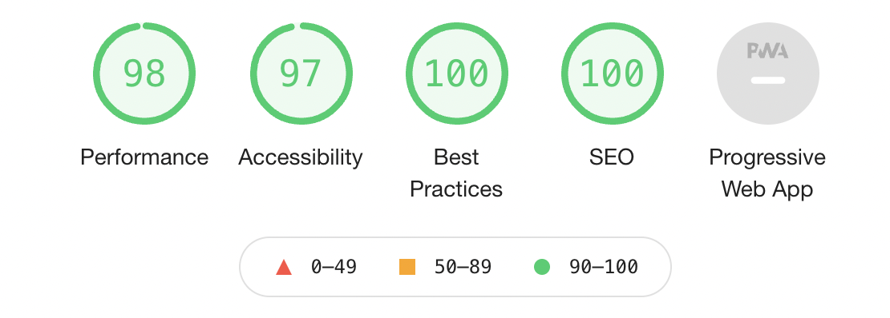
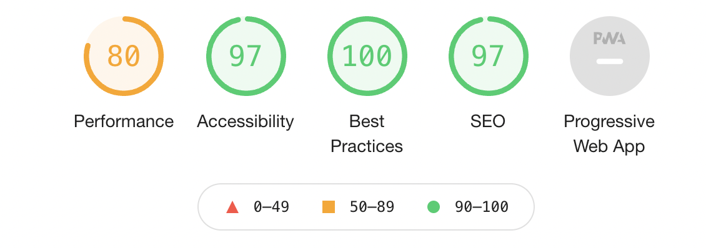

# The Bike People - Testing

## Welcome - [Preview The Bike People](https://jamitag.github.io/The-Bike-People/)

## Compatability

I tested the sites compatabillity on different browsers and screen resolutions. Across multiple browsers 
(Chrome, Safari and Mozilla) the site appeared largely as expected, the exception being on Safari; 
my selected font, Raleway failed to function. Several devices of varying screen sizes 
(Iphone 12, MacBook Pro, Ipad) where also tested.

## Validator testing 

### HTML

I tested the HTML for each page using the [W3C HTML validation service](https://validator.w3.org/nu/)

Both Home and Servicing pages where found to have no issues. Issues uncovered on the Social Spin page can 
be seen below;

As you can see, the errors where mostly stray tags and unclosed elements which were easily debugged.

### CSS

My style.css file was tested using the [W3C CSS validation service](https://jigsaw.w3.org/css-validator/) and 
showed no errors.

## Performance testing

Performance was tested using the Lighthouse report function within Chrome Dev Tools.

The following results where generated;

- Homepage for desktop result

- Homepage for mobile result

- Servicing page for desktop result

- Servicing page for mobile result

- Social Spin page for desktop result

- Social Spin page for mobile result

## Issues

<b>Issue</b>
There was difficulty aligning link elements within the nav-bar to the right.

<b>Solution</b>
Following a quick discussion with a tutor, it was discovered I simply had to target the actual link items 
for styling instead of the parent container DIV.

<b>Issue</b>
I was unable to align the three service plan DIVs horizontially to make responsive for mobile screens. 
They where originally floated to make them appear inline.

<b>Solution</b>
I tried a solution from stackoveflow.com which suggested I had to wrap a container around each DIV 
representing each service plan and style it as display: flex; to appear horizontially and then add 
display: block in the media query to revert to a vertical position.

<b>Issue</b>
I created a table displaying the ride details on the Social Spin page which when viewed on a desktop, appeared 
neatly across the width of the screen. However, when the screen size was reduced, I had difficulty making the 
table display vertically.

<b>Solution</b>
I was unable to find a solution to make the table display vertically for mobile devices and therefore decided 
to replace the table with multiple divs containing the necessary information which I was then able to make 
responsive using the technique I had picked up from the previous issue.